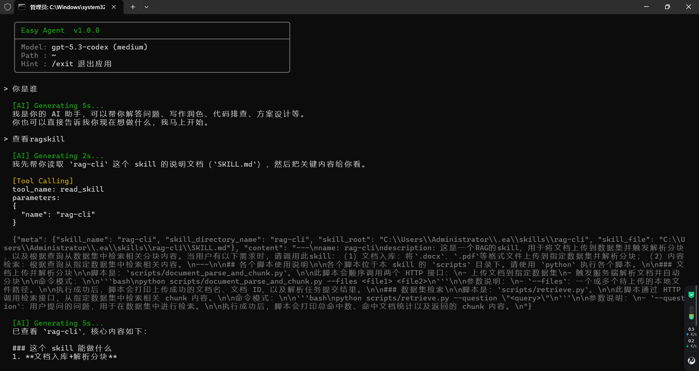

# Easy Agent

Easy Agent 是一个运行在终端里的轻量级智能助手，面向日常开发、脚本协助和本地自动化场景。它提供类似 Claude Code / Codex 的基本交互方式：直接对话、按需调用工具、支持Skill扩展，并支持接入MCP Server。

## 功能概览

- 在命令行中直接与 Agent 对话
- 内置文件读取、搜索、编辑、Shell 等工具
- Shell 工具会按系统选择 shell：Windows 使用 PowerShell，Linux/macOS 使用 Bash，并支持后台任务查询、取消，以及超时后的输出预览
- 支持项目级和用户级 `skills`
- 支持自动会话压缩与 token 估算
- 支持通过 `stdio`、`sse`、`streamable_http` 接入 MCP Server

## 安装

本地开发安装：

```bash
git clone https://github.com/Arvin273/easy-agent.git
cd easy-agent
pip install -e .
```

通过 Git 仓库直接安装：

```bash
pip install git+https://github.com/Arvin273/easy-agent.git
```

安装完成后会注册命令：

```bash
ea
```

## 启动方式

在任意目录运行：

```bash
ea
```

Agent 会把当前目录当作工作目录。例如你在 `D:\code\project\demo` 下启动，后续文件工具和 Shell 默认都在这个目录范围内工作。

## 首次配置

首次运行会自动生成配置文件：

- `~/.ea/config.json`

最小配置示例：

```json
{
  "api_key": "你的API密钥",
  "base_url": "",
  "model": "gpt-5.4",
  "effort": "medium",
  "token_threshold": 100000,
  "keep_recent_messages_count": 10
}
```

字段说明：

- `api_key`：必填
- `base_url`：可选，使用代理或兼容网关时填写
- `model`：模型名，默认 `gpt-5.4`
- `effort`：推理强度，可选 `none`、`minimal`、`low`、`medium`、`high`、`xhigh`
- `token_threshold`：触发自动压缩的 token 阈值
- `keep_recent_messages_count`：压缩时保留的最近消息数量

## MCP 配置

当前支持三种 MCP 接入方式：

- `stdio`
- `sse`
- `streamable_http`

MCP 不再写在 `~/.ea/config.json` 中，而是独立写在两个位置：

- 用户级：`~/.ea/mcp.json`
- 项目级：`./.ea/mcp.json`

加载规则：

- 两个文件都会读取
- 用户级 `~/.ea/mcp.json` 不存在时会自动创建默认文件
- 项目级配置覆盖用户级配置
- 以 `name` 作为覆盖键
- 修改后重启 `ea` 最稳妥

文件内容既可以写成对象：

```json
{
  "mcp_servers": []
}
```

也可以直接写成数组：

```json
[]
```

### 1. stdio

用于启动本地 MCP Server 进程，通过标准输入输出通信。

```json
{
  "mcp_servers": [
    {
      "name": "filesystem",
      "transport": "stdio",
      "command": "npx",
      "args": [
        "-y",
        "@modelcontextprotocol/server-filesystem",
        "D:/code/project/easy-agent"
      ]
    }
  ]
}
```

### 2. sse

用于连接已经运行中的旧版 HTTP MCP Server。

```json
{
  "mcp_servers": [
    {
      "name": "legacy-sse",
      "transport": "sse",
      "url": "http://127.0.0.1:3001/sse"
    }
  ]
}
```

### 3. streamable_http

用于连接新版 HTTP MCP Server。

```json
{
  "mcp_servers": [
    {
      "name": "python-streamable",
      "transport": "streamable_http",
      "url": "http://127.0.0.1:8000/mcp"
    }
  ]
}
```

常用规则：

- `name` 必须唯一
- `stdio` 必须填写 `command`
- `sse` 和 `streamable_http` 必须填写 `url`
- 需要鉴权时可额外配置 `headers`

## 基本使用

启动后直接输入自然语言即可，例如：

- `读取当前目录并总结项目结构`
- `帮我给这个仓库写一个发布说明`
- `搜索 src 目录里所有 TODO`
- `把 README 里的安装部分重写一下`

常用内置命令：

- `/help`：查看命令帮助
- `/skills`：查看已发现的 skills
- `/tools`：查看当前可用 tools
- `/model`：切换模型和推理强度，当前会话后续请求立即生效
- `/compact`：手动压缩当前会话
- `/tokens`：查看 token 估算
- `/config`：查看当前配置摘要
- `/exit`：退出

也支持直接执行本地命令：

- 以 `!` 开头时会直接执行后面的命令，不发送给模型
- 例如 `!pwd`、`!git status`、`!pytest -q`

## AGENTS.md

Easy Agent 会读取 `AGENTS.md` 作为额外指令来源，用来约束回答风格、协作方式和项目级规则。

支持两个位置：

- 用户目录：`~/.ea/AGENTS.md`
- 项目目录：当前工作目录下的 `AGENTS.md`

规则说明：

- 用户目录中的 `AGENTS.md` 适合放通用习惯，例如回复语言、协作偏好、代码风格要求
- 项目目录中的 `AGENTS.md` 适合放仓库专属规则，例如目录约定、测试要求、提交规范
- 当两者同时存在且内容冲突时，项目目录中的 `AGENTS.md` 优先

常见用途：

- 规定回答使用中文
- 要求修改代码前先阅读某些目录
- 规定提交前必须运行哪些测试
- 约束文档、代码或 commit message 的风格

示例：

```md
# Repository Guidelines

## Coding Style

- 修改 Python 代码时保持 4 空格缩进
- 新增测试放在 `src/test`

## Validation

- 提交前运行 `python -m compileall src/core`
```

## Skills

程序会自动从以下目录发现 skills：

- 当前工作目录：`./.ea/skills/`
- 用户目录：`~/.ea/skills/`

目录下包含 `SKILL.md` 即可被识别。同名 skill 同时存在时，工作目录中的版本优先。

## 项目结构

主要目录如下：

- `src/core/main.py`：CLI 入口
- `src/core/commands/`：斜杠命令
- `src/core/tools/`：内置工具
- `src/core/context/`：技能、提示词、压缩相关逻辑
- `src/core/config/`：配置加载
- `src/core/terminal/`：终端交互和输出
- `src/core/mcp/`：MCP 接入层
- `src/test/`：单元测试
- `assets/`：演示图片等静态资源

## 注意事项

- 不要提交真实 API Key
- 本地配置保存在 `~/.ea/config.json`
- MCP 配置保存在 `~/.ea/mcp.json` 和 `./.ea/mcp.json`

## 演示图


