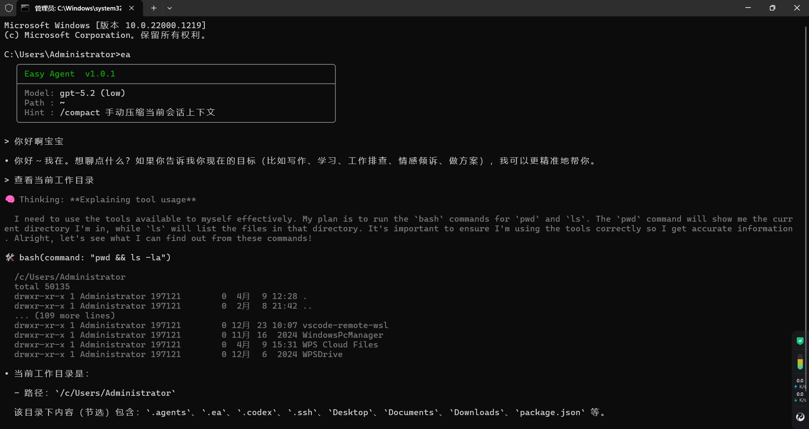

# Easy Agent

一个轻量级的终端智能助手（轻量级 Claude Code / Codex）：

- 在命令行里直接对话
- 可按需调用工具完成任务
- 支持基于 `skills` 的能力扩展
- 基于 `prompt_toolkit` 的增强交互输入

适合个人开发、脚本协助、和日常自动化场景。

## 安装

方式一：克隆仓库后本地安装

```bash
# clone 后进入项目目录
pip install -e .
```

安装完成后会注册全局命令 `ea`。

方式二：通过 Git 仓库直接安装(推荐)

```bash
pip install git+https://gitee.com/c031001/easy-agent.git
```

或：

```bash
pip install git+https://github.com/Arvin273/easy-agent.git
```

## 启动与工作目录

你可以在任何目录直接启动：

```bash
ea
```

注意：你从哪个目录启动，哪个目录就是当前会话的工作目录（working directory）。

例如：

- 在 `D:\code\project\demo` 里执行 `ea`，助手就以 `D:\code\project\demo` 作为当前工作区。

## 首次配置

首次运行会自动创建配置文件：

- `~/.ea/config.json`

至少需要填写 `api_key`：

```json
{
  "api_key": "你的API密钥",
  "base_url": "",
  "model": "gpt-5.4",
  "effort": "medium",
  "token_threshold": 100000,
  "keep_recent_tool_outputs": 10,
  "min_compact_output_length": 100
}
```

字段说明：

- `api_key`：必填。
- `base_url`：可选；使用代理或兼容网关时填写。
- `model`：默认 `gpt-5.4`。
- `effort`：推理强度，常用 `medium`。
- `token_threshold`：触发自动会话压缩的 token 估算阈值。
- `keep_recent_tool_outputs`：保留最近多少条工具输出不做微压缩。
- `min_compact_output_length`：工具输出达到该长度才会被微压缩。

## 基本使用

启动后直接输入问题即可，例如：

- `帮我写一个发布说明模板`
- `读取当前目录并给出重构建议`

内置命令（持续更新）：

- `/help`：查看命令帮助
- `/skills`：查看已发现 skills（显示具体目录路径）
- `/model`：切换模型与推理强度（`↑/↓ + Enter`，`Ctrl+C` 取消）
- `/compact`：手动压缩当前会话上下文
- `/tokens`：查看当前会话 token 估算用量
- `/exit`：退出

交互说明：

- 输入框为空时不会发送消息。
- 以 `/` 开头输入时会实时显示 slash 命令前缀匹配列表，可用 `↑/↓` 选择，`Enter` 直接提交选中命令。
- 非 `bash` 工具输出在终端统一展示为：前 4 行 + `... (N more lines)` + 后 4 行。
- `bash` 工具为实时输出，并带滚动预览。

## Skills 放在哪里

程序会自动从以下两个位置发现 skills（目录名下需包含 `SKILL.md`）：

- 当前工作目录：`./.ea/skills/`
- 用户家目录：`~/.ea/skills/`

当同名 skill 同时存在时，工作目录下的版本会覆盖家目录版本，便于项目级定制。

## 开发与校验

常用开发命令：

```bash
pip install -e .
python -m compileall src/core
```

- `pip install -e .`：可编辑安装并注册 `ea` 命令。
- `python -m compileall src/core`：快速检查核心代码语法。

## 版本与更新

本项目会持续更新，目标是实现claude code的所有核心功能。

更新方法：

```bash
git pull
pip install -e .
```

## 演示图


