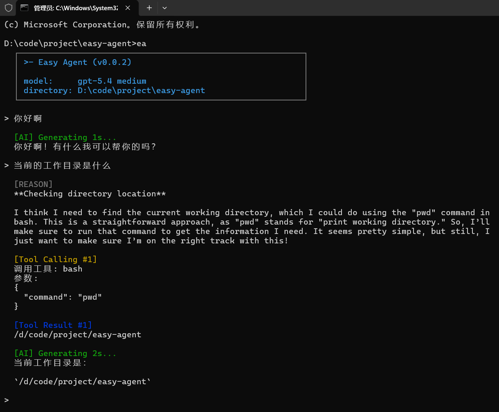

# Easy Agent

一个轻量级的终端智能助手（轻量级 Claude Code / Codex）：
- 在命令行里直接对话
- 可按需调用工具完成任务
- 支持基于 `skills` 的能力扩展

适合个人开发、脚本协助、和日常自动化场景。

## 安装

在本项目根目录执行：

```bash
pip install -e .
```

安装完成后会注册全局命令 `ea`。

## 启动与工作目录

你可以在任何目录直接启动：

```bash
ea
```

注意：你从哪个目录启动，哪个目录就是当前会话的工作目录（working directory）。

例如：
- 在 `D:\code\project\demo` 里执行 `ea`，助手就以 `D:\code\project\demo` 作为当前工作区。

## 首次配置

首次运行会自动创建配置文件：

- `~/.agents/config.json`

至少需要填写 `api_key`：

```json
{
  "api_key": "你的API密钥",
  "base_url": "",
  "model": "gpt-5.4",
  "effort": "medium"
}
```

字段说明：
- `api_key`：必填。
- `base_url`：可选；使用代理或兼容网关时填写。
- `model`：默认 `gpt-5.4`。
- `effort`：推理强度，常用 `medium`。

## 基本使用

启动后直接输入问题即可，例如：
- `帮我写一个发布说明模板`
- `读取当前目录并给出重构建议`

内置命令（持续更新）：
- `/help`：查看命令帮助
- `/skills`：查看已发现 skills
- `/exit`：退出

## Skills 放在哪里

程序会自动从以下两个位置发现 skills（目录名下需包含 `SKILL.md`）：

- 当前工作目录：`./.agents/skills/`
- 用户家目录：`~/.agents/skills/`

当同名 skill 同时存在时，工作目录下的版本会覆盖家目录版本，便于项目级定制。

## 版本与更新

本项目会持续更新，目标是实现claude code的所有核心功能。

更新方法：
```bash
git pull
pip install -e .
```

## 演示图


